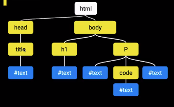

# JS Pro Tips

## What does it mean to be a JS Pro?

The road to be a professional is hard, it's the famous jr-to-sr path. The reality is that you can get there.

- Language Knowledge
- IDE Knowledge
- Best Practices
- Have a toolbox
- Ethics and professionalism
- Experience

JavaScript, as other languages, has a set of fundamentals that are a must-be to start with them. Furthermore, there are non-fundamental topics that are a nice-to learn but not needed at the beginning. The non-fundamentals are great to understand how the technology works and stop believing it's just magic.

### JS Non-Fundamentals

- Promises (In a super pro way)
- Getters & Setters in Classes
- Proxies
- Generators
- JavaScript Engine
- Prototype Inheritance
- Event loop
- Design patterns

## Starting a Project

### Initializing NPM

- Initialize the project. That is, create a `package.json` file with the project info (some metadata) and the dependencies manifest.

```shell
npm init -y
```

- Install a development server.

```shell
npm install -D live-server
```

In `package.json` file a script can be created to associate the live-server with some npm command.

```javascript
// package.json
// ...
"scripts": {
	"start": "live-server"
},
// ...
```

## JS Fundamentals Review

### How does a script get to the browser?

Scripts are always linked in a HTML document. The HTML document is sent to the browser, and the browser starts interpreting each row of the HTML document, assembling the DOM (Document Object Model). The DOM is structured with a tree architecture.



When the browser finished the interpretation of the DOM, the `DOMContentLoaded`event is triggered.

There are some ways to load a `<script>` tag while the DOM is being processed.

- Code embedded inside a simple `<script>` tag.

  ```html
  <script>
  	const button = document.querySelector(".button");
      button.addEventListener("click", function foo() {console.log("bar");});
  </script>
  ```

  For this case, the DOM load is stopped while the browser interprets and executes the JS script.

  

  So it's important to have in mind that the only objects available in the DOM are those that have been already processed by the browser **before** the script execution. So, to avoid problems regarding the 

- Code imported  via `src` in a simple `<script>` tag.

  ```html
  <script src="https://some-url/jquery.js"></script>
  ```

  Similar to the previous case, the DOM load is stopped while the browser **fetches** and **executes** the JS script.

  

- Using **`async`**

  ```html
  <script async src="https://some-url/jquery.js"></script>
  ```

  Adding the `async` attribute to the script, the DOM load is not interrupted while the browser **fetches** the script, but it is stopped when it is **executed**.

  

- Using **`defer`**

  ```html
  <script defer src="https://some-url/jquery.js"></script>
  ```

  Adding the `defer` attribute to the script, the DOM load is not interrupted while the browser **fetches** the script. And the **execution** is done only at the end, when the DOM load is finished.

  

### Scope

The scope of a variable represents the lifetime that a variable will be available in the code. Javascript has had a poor scoping system, but with the latest EcmaScript implementations (ES6+), this has been improved.

#### Global Scope

Global scope refers to everything that is defined outside a function or outside a block.

```html
<script>
    var message = "Hello";
    // in the browser console this variable will be attached to window
    // window.message will return "Hello"
</script>
```

The danger of having a global scope is that there is no restriction to do anything and mistakes can be made. For example, if an external library is being imported, any variable defined in the global scope in that library can be overwritten by mistake.

#### Function Scope

When a function is defined, a new scope is created inside of it.

```javascript
function printNumbers() {					
    for (var i = 0; i < 10; i++) {		// i is defined withing the scope of the function
        setTimeout(function () {	// the loop will end before the timeOut event is triggered
            console.log(i);			// when the event is finally triggered, the value of i will be 10
        }, 100)
    };
};

printNumbers(); // will print the number 10 ten times.
```

To catch and remember the value of i on every step of the iteration, a new function scope inside the current function scope can be defined:

```javascript
function printNumbers() {
    var i;									// i is defined withing the scope of the function
    for (i = 0; i < 10; i++) {
        function printTimeoutNumber(n) {	// a new scope inside the function is defined
            setTimeout(function () {
        		console.log(n);
        	}, 100)
        }
        
        printTimeoutNumber(i);				// i is passed to the new scope as an argument
    };
};

printNumbers(); // will print the numbers 0 to 9.
```

#### Block Scope

A block in JS is everything wrapped by `{ }`. This is introduced in ES6, and the idea is that `let` and `const` ways to declare variables are making them valid only within the scope it is being used, instead of `var`, which applies all the other scope rules. So the previous code just works if  `i` is defined with `let` instead of `var`.

```javascript
function printNumbers() {					
    for (let i = 0; i < 10; i++) {	// i is defined withing the scope of the function
        setTimeout(function () {	// but here a new block scope is created
            console.log(i);			// so the value of i is caught and reminded.
        }, 100)
    };
};

printNumbers(); // will print the numbers 0 to 9.
```

#### Modules Scope

Modules are JS files that are exported and imported. A module scope limits the life of the variable only within the file.

```html
<script type="module">
    var a = "helloo"
</script>
<script>
    console.log(a) // will return undefined
</script>
```

In the ES6 modules, the `export` command specifies the variable(s) that can be called (with `import`) outside the module.

### `this`

`this` refers the object on which the code chunk is being executed

#### this in the global scope

```javascript
console.log(this)		// returns the Window Object
```

#### this in the function scope

```javascript
function whoIsThis() {
	console.log(this)
}

whoIsThis();	// still returns the window object
```

But with the strict mode of ES6, 

```javascript
function whoIsThis() {
	'use strict';
	console.log(this)
}

whoIsThis();	// returns undefined
```

The strict mode is simply some functionality that JS engine implements to modify some behaviors that are not very intuitive.

#### this in the context of an object

```javascript
const person = {
    name: "Miguel",
    greet: console.log(`Hey! I'm ${this.name}`)
}
person.greet() // returns "Hey! I'm Miguel"
```

Continuing the above code, if somehow the method is passed to a new global function, then:

```javascript
const myFunction = person.greet;
myFunction()	// returns "Hey! I'm"
```

#### this in the context of classes

`this` in classes **will refer to the class instance**, not the prototype object.

```javascript
function Person(name) {
    this.name = name;
}

Person.prototype.greet = function() {
    console.log(`Hey! I'm ${this.name}`);
}

const guy = new Person("Jerry");
guy.greet();	// returns "Hey! I'm Jerry"
```

### Modifying the behavior of `this`

`call`, `apply` and `bind` all of them specify the object on which `this` will be referring to inside a function.

- `call` will call the function, attach the object referral to `this`, and passes additional arguments to the function separated by commas.
- `apply` will call the function, attach the object referral to `this`, and passes additional arguments to the function but wrapped inside an array.
- `bind` will attach the object referral to `this` and returns a new function with that functionality. This new function can be saved in a new variable and used later whenever needed.

```javascript
function walk(distance, direction) {
    console.log(`Hey! I'm ${this.firstName} ${this.lastName}. I walked ${distance} mts to the ${direction}`);
}

const guy = {
    firstName: "Jerry",
    lastName: "Griffin"
}
// these all return "Hey! I'm Jerry Griffin. I walked 400 mts to the north"
// using call
walk.call(guy, 400, "north");
// using apply
walk.apply(guy, [400, "north"]);
// using bind
const guyWalk = walk.bind(guy);
guyWalk(400, "north");
```

### Prototype and Inheritance

This is almost a unique JS topic, that changes the way we deal with classes and objects.

- Simple objects

  ```javascript
  const zelda = {
  	name: "Zelda"
  }
  
  zelda.greet = function() {
      console.log(`Hey! I'm ${this.name}`)
  }
  
  const link = {
      name: "Link"
  }
  
  link.greet = function() {
      console.log(`Hey! I'm ${this.name}`)
  }
  ```

- In order to avoid DRY, we can create a function that returns a hero object:

  ```javascript
  function Hero(name) {
      const hero = {
          name: name
      }
      
      hero.greet = function() {
          console.log(`Hey! I'm ${this.name}`)
      }
      
      return hero;
  }
  
  const zelda = Hero("Zelda");
  const link = Hero("Link");
  ```

- One problem still: The `greet` function is defined every time a new hero is created. We can do something to avoid this:

  ```javascript
  const heroMethods = {
  	greet: function() {
          console.log(`Hey! I'm ${this.name}`)
      }
  }
  
  function Hero(name) {
      const hero = {
          name: name
      }
      
      hero.greet = heroMethods.greet;
      return hero;
  }
  
  const zelda = Hero("Zelda");
  const link = Hero("Link");
  ```

- This can be refactored using `Object.create()`. This method receives an object as an argument and appends this object to the prototype of a new one. That's how inheritance works.. The prototype of an object is appended to the prototype of the other and so on :).

  ```javascript
  const heroMethods = {
  	greet: function() {
          console.log(`Hey! I'm ${this.name}`)
      }
  }
  
  function Hero(name) {
      const hero Object.create(heroMethods);
      hero.name = name;
  
      return hero;
  }
  
  const zelda = Hero("Zelda");
  const link = Hero("Link");
  ```

- Adding some syntactic sugar. With `new ClassName()`  the above code can be replaced with this:

  ```javascript
  function Hero(name) {
      this.name = name
  }
  
  Hero.prototype.greet = function() {
      console.log(`Hey! I'm ${this.name}`)
  }
  
  const zelda = new Hero('Zelda')
  const link = new Hero('Link')
  ```


