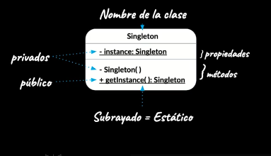

# Design Patterns
## What are design patterns

A design pattern is a solution for a common problem. It's some sort of recipe for a given recurring context. The problem must be limited and the solution must be generic, in order to be able to use it correctly.

Design patterns is a concept taken from architecture, used with the same purpose.

### Benefits
- Work as a toolbox for common problems
- Provide a common language to discuss with colleages when taking decisions about architecture.

### Disadvantages
- They introduce some level of complexity to the codebase.
- You shouldn't be constantly thinking of design patterns to solve everything. Solutions must be fluid and simple, leave complex solutions to complex problems.

## Design Patterns Categories
### Creational Patterns
They provide different ways of creating objects.
- Abstract Factory
- Builder
- Factory method
- Prototype
- Singleton

#### Builder
They allow the creation of complex objects from a source object.

`jQuery` uses the builder pattern.

#### Singleton
It's a pattern where a class only creates one single instance of itself, and only that instance can be consumed by other objects.



In a singleton, the constructor is private, and a public class method `getInstance()` that creates an instance of the singleton if it doesn't exist, or returns the existing one.

*Ex*: Mongoose is an ORM. The class that handles the communication between the database and the models is a Singleton.

```typescript
class Singleton {
  private static instance: Singleton;
  
  private constructor() {
    // init
  }

  static getInstance() {
    if (!Singleton.instance) {
      Singleton.instance = new Singleton();
    }

    return Singleton.instance;
  }
}

export default Singleton;
```

### Structural Patterns
They describe ways to compose objects.
- Adapter
- Bridge
- Composite
- Decorator
- Facade
- Fluyweight
- Proxy

`jQuery` uses the adapter pattern.

### Behavioral Patterns
They manage algorithms and responsabilities among them
- Chain of responsibility
- Command
- Interpreter
- Iterator
- Mediator
- Memento
- Observer
- State
- Strategy
- Template Method
- Visitor

`jQuery` uses the Composite pattern.